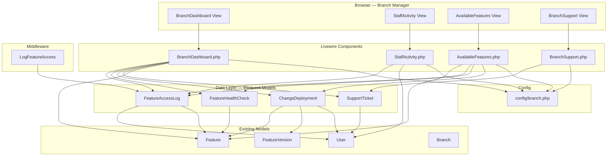
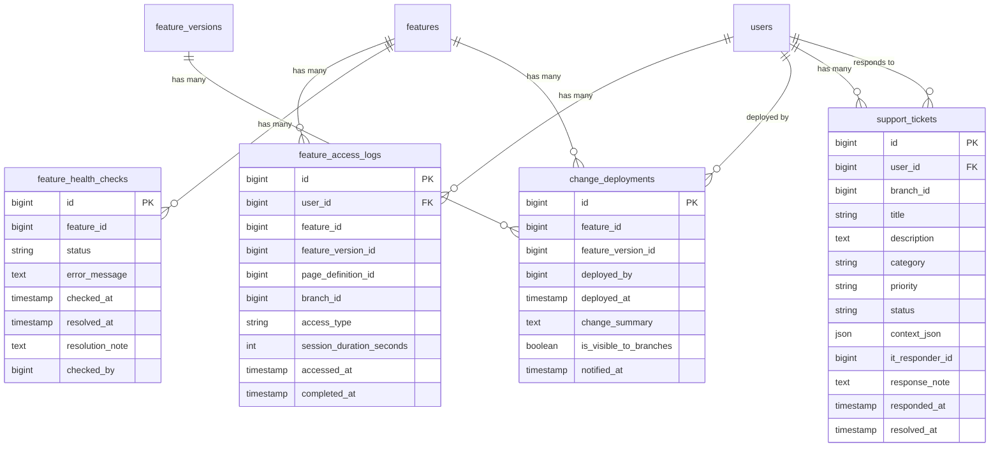

# Design Document: Branch Operations Dashboard

## Overview

The Branch Operations Dashboard provides Branch Managers with a real-time operational view of their branch: staff activity, feature availability, IT deployments, and support ticket management. The system is built on a data layer of 4 Eloquent models (`FeatureAccessLog`, `FeatureHealthCheck`, `ChangeDeployment`, `SupportTicket`) backed by a single migration, and a UI layer of 4 Livewire 3 components (`BranchDashboard`, `StaffActivity`, `AvailableFeatures`, `BranchSupport`) rendered inside the existing `layouts.branch` sidebar layout.

The existing codebase already has:
- All 4 Eloquent models fully implemented with fillable, casts, relationships, scopes, and helpers
- The migration file creating all 4 tables with proper indexes and foreign keys
- The `LogFeatureAccess` middleware writing to `FeatureAccessLog` and `AuditTrail`
- The `config/branch.php` configuration with all required keys
- `BranchDashboard.php` and `StaffActivity.php` with full render logic
- `AvailableFeatures.php` and `BranchSupport.php` with full render logic
- Routes registered under `/branch/*` with `role:branch_manager` middleware

What remains is:
1. The `BranchDashboardSeeder` to generate realistic test data
2. Blade view templates for all 4 Livewire components
3. Any missing model refinements or scope gaps identified during design review

## Architecture



All components use Livewire polling for auto-refresh. Data is scoped to the authenticated user's `branch_id`. The sidebar layout (`layouts.branch`) provides navigation between the 4 pages.

## Components and Interfaces

### 1. FeatureAccessLog Model (`App\Models\Branch\FeatureAccessLog`)

Already implemented. Key interface:

| Method | Type | Description |
|--------|------|-------------|
| `scopeForBranch($branchId)` | Scope | Filters by branch_id |
| `scopeRecent($minutes)` | Scope | Records within N minutes |
| `scopeToday()` | Scope | Records from today |
| `scopeThisWeek()` | Scope | Records from current week |
| `user()` | BelongsTo | → User |
| `feature()` | BelongsTo | → Feature |

### 2. FeatureHealthCheck Model (`App\Models\Branch\FeatureHealthCheck`)

Already implemented. Key interface:

| Method | Type | Description |
|--------|------|-------------|
| `scopeHasIssues()` | Scope | degraded/unavailable + unresolved |
| `scopeForFeature($featureId)` | Scope | Filters by feature_id |
| `scopeActive()` | Scope | Unresolved records |
| `isResolved()` | Helper | true when resolved_at is set |
| `feature()` | BelongsTo | → Feature |

### 3. ChangeDeployment Model (`App\Models\Branch\ChangeDeployment`)

Already implemented. Key interface:

| Method | Type | Description |
|--------|------|-------------|
| `scopeVisibleToBranches()` | Scope | is_visible_to_branches = true |
| `scopeRecent($days)` | Scope | Deployed within N days |
| `isNew()` | Helper | true when within configured badge hours |
| `feature()` | BelongsTo | → Feature |
| `featureVersion()` | BelongsTo | → FeatureVersion |
| `deployedByUser()` | BelongsTo | → User (deployed_by) |

### 4. SupportTicket Model (`App\Models\Branch\SupportTicket`)

Already implemented. Key interface:

| Method | Type | Description |
|--------|------|-------------|
| `scopeOpen()` | Scope | status in [open, in_progress] |
| `scopeForBranch($branchId)` | Scope | Filters by branch_id |
| `scopeForUser($userId)` | Scope | Filters by user_id |
| `isOpen()` | Helper | true when status is open/in_progress |
| `priority_color` | Accessor | Tailwind color for priority |
| `status_color` | Accessor | Tailwind color for status |
| `user()` | BelongsTo | → User |
| `responder()` | BelongsTo | → User (it_responder_id) |

### 5. BranchDashboard Component (`App\Livewire\Branch\BranchDashboard`)

Already implemented. Renders stats cards, health status, deployment tracker, feature availability table, and open ticket count. Uses `wire:poll.30s` for auto-refresh.

### 6. StaffActivity Component (`App\Livewire\Branch\StaffActivity`)

Already implemented. Displays staff list with activity status, access counts, period toggle (today/week), and summary stats. Uses `wire:poll.120s`.

### 7. AvailableFeatures Component (`App\Livewire\Branch\AvailableFeatures`)

Already implemented. Lists published features with health status, usage metrics, deployment info, and search with debounce.

### 8. BranchSupport Component (`App\Livewire\Branch\BranchSupport`)

Already implemented. Ticket list with filter, new ticket modal form with validation, IT contact info display.

### 9. LogFeatureAccess Middleware (`App\Http\Middleware\LogFeatureAccess`)

Already implemented. Creates `FeatureAccessLog` on feature route access. Creates `AuditTrail` when branch manager is in Staff View mode. Fails silently on errors.

### 10. BranchDashboardSeeder (to be created)

New seeder at `database/seeders/BranchDashboardSeeder.php`. Generates realistic test data for all 4 models using existing users, features, and branches from the database.

## Data Models

### Entity Relationship Diagram



### Table Indexes

| Table | Index Columns | Purpose |
|-------|--------------|---------|
| feature_access_logs | (user_id, accessed_at) | Staff activity queries |
| feature_access_logs | (feature_id, accessed_at) | Feature usage queries |
| feature_access_logs | (branch_id, accessed_at) | Branch-scoped queries |
| feature_access_logs | (access_type) | Type filtering |
| feature_health_checks | (feature_id, status) | Feature health lookups |
| feature_health_checks | (checked_at) | Time-based queries |
| support_tickets | (user_id, status) | User ticket queries |
| support_tickets | (branch_id, status) | Branch ticket queries |
| support_tickets | (status, priority) | Priority-based filtering |
| change_deployments | (feature_id, deployed_at) | Feature deployment history |
| change_deployments | (deployed_at) | Recent deployments |
| change_deployments | (is_visible_to_branches) | Branch visibility filter |

### Configuration Schema (`config/branch.php`)

```php
return [
    'it_support' => [
        'email' => 'it-support@arrahnu.com',
        'phone' => '+603-XXXX-XXXX',
        'hours' => 'Mon-Fri 9:00 AM - 6:00 PM',
    ],
    'dashboard' => [
        'poll_interval' => '30s',
        'new_feature_badge_hours' => 24,
        'inactive_staff_threshold_hours' => 4,
        'active_staff_window_minutes' => 15,
    ],
];
```

### Seeder Design (`BranchDashboardSeeder`)

The seeder generates data in this order:

1. **Resolve dependencies**: Load existing users (branch staff), features (published), and branches from the database
2. **FeatureAccessLog records**: For each branch staff member, create 5-15 access records distributed across the current week, randomly assigned to published features
3. **FeatureHealthCheck records**: Create 2-4 records — at least one "available" (resolved), one "degraded" (unresolved), and optionally one "unavailable"
4. **ChangeDeployment records**: Create 3-5 records for published features with `is_visible_to_branches = true`, including at least one deployed within the last 24 hours
5. **SupportTicket records**: Create 3-5 tickets with varied categories/priorities/statuses, including at least one open and one resolved with `response_note`

All records reference valid foreign keys from the existing seeded data.


## Correctness Properties

*A property is a characteristic or behavior that should hold true across all valid executions of a system — essentially, a formal statement about what the system should do. Properties serve as the bridge between human-readable specifications and machine-verifiable correctness guarantees.*

### Property 1: Model attribute round-trip preservation

*For any* valid attribute set for FeatureAccessLog, FeatureHealthCheck, ChangeDeployment, or SupportTicket, creating the model with those attributes and reloading it from the database SHALL preserve all field values, including datetime fields returned as Carbon instances and JSON fields returned as arrays.

**Validates: Requirements 1.1, 1.7, 2.1, 2.6, 3.1, 3.5, 4.1, 4.6**

### Property 2: Equality-filter scopes return exact matches

*For any* set of records and any target ID value, applying `forBranch($id)` on FeatureAccessLog, `forFeature($id)` on FeatureHealthCheck, `forBranch($id)` on SupportTicket, or `forUser($id)` on SupportTicket SHALL return exactly those records where the filtered column equals the target ID — no matching records excluded, no non-matching records included.

**Validates: Requirements 1.2, 2.3, 4.3, 4.4**

### Property 3: Time-window scopes return records within boundaries

*For any* set of FeatureAccessLog records with varied `accessed_at` timestamps, applying `recent($minutes)` SHALL return exactly those records where `accessed_at` is within the last N minutes, `today()` SHALL return exactly those where `accessed_at` falls on the current date, and `thisWeek()` SHALL return exactly those where `accessed_at` falls within the current week boundaries. The same pattern applies to `ChangeDeployment::recent($days)` filtering by `deployed_at`.

**Validates: Requirements 1.3, 1.4, 1.5, 3.3**

### Property 4: Status-based scopes filter by compound criteria

*For any* set of records with varied status and resolution values: `FeatureHealthCheck::hasIssues()` SHALL return exactly records where status is "degraded" or "unavailable" AND resolved_at is null; `FeatureHealthCheck::active()` SHALL return exactly records where resolved_at is null; `SupportTicket::open()` SHALL return exactly records where status is "open" or "in_progress"; `ChangeDeployment::visibleToBranches()` SHALL return exactly records where is_visible_to_branches is true.

**Validates: Requirements 2.2, 2.4, 3.2, 4.2**

### Property 5: Boolean helper methods match attribute predicates

*For any* FeatureHealthCheck, `isResolved()` SHALL return true if and only if `resolved_at` is not null. *For any* SupportTicket, `isOpen()` SHALL return true if and only if `status` is "open" or "in_progress". *For any* ChangeDeployment, `isNew()` SHALL return true if and only if `deployed_at` is within the configured `branch.dashboard.new_feature_badge_hours` threshold from the current time.

**Validates: Requirements 2.7, 3.6, 4.8**

### Property 6: Color accessors map all valid enum values to non-empty strings

*For any* SupportTicket with a valid priority value (low, medium, high, critical), `priority_color` SHALL return a non-empty Tailwind color string. *For any* SupportTicket with a valid status value (open, in_progress, resolved, closed), `status_color` SHALL return a non-empty Tailwind color string. Different enum values SHALL map to distinct colors.

**Validates: Requirements 4.7**

## Error Handling

### Middleware Error Handling
- `LogFeatureAccess` wraps `FeatureAccessLog::create()` in a try/catch — failures log a warning and return the response uninterrupted (Req 11.3)
- If the feature route parameter cannot be resolved or the Feature model is not found, the middleware skips logging entirely (Req 11.2)
- AuditTrail creation for Staff View mode is also wrapped in try/catch with warning logging

### Component Error Handling
- All Livewire components use `auth()->user()->branch_id` for scoping — if null, queries return empty results gracefully
- `AvailableFeatures` handles missing health checks by defaulting to "available" status
- `BranchSupport` validates ticket form input with Laravel validation rules; invalid submissions display error messages below fields (Req 10.5)
- `BranchDashboard` handles division by zero in avgPerHour calculation with a ternary guard

### Seeder Error Handling
- The seeder checks for existing users, features, and branches before generating data
- If no published features exist, the seeder skips FeatureAccessLog and ChangeDeployment generation
- If no branch staff exist, the seeder skips FeatureAccessLog generation

## Testing Strategy

### Property-Based Tests (PHPUnit + custom generators)

PBT is appropriate for this feature because the model scopes and helpers are pure functions with clear input/output behavior and universal properties that hold across a wide input space.

- **Library**: PHPUnit with custom data providers generating randomized inputs (PHP lacks a mature PBT library, so we use data providers with `Faker` to approximate property-based testing with 100+ iterations)
- **Minimum iterations**: 100 per property test
- **Tag format**: `Feature: branch-operations-dashboard, Property {N}: {title}`

Property tests cover:
1. Model attribute round-trip for all 4 models
2. Equality-filter scope correctness
3. Time-window scope correctness
4. Status-based scope correctness
5. Boolean helper method correctness
6. Color accessor mapping completeness

### Unit Tests (PHPUnit + Livewire testing)

- Livewire component rendering with known data (Req 7-10)
- Ticket form validation (Req 10.3-10.5)
- Relationship wiring verification (Req 1.6, 2.5, 3.4, 4.5)
- Configuration value reading (Req 12.1-12.5)

### Integration Tests

- `LogFeatureAccess` middleware creates FeatureAccessLog on feature route access (Req 11.1)
- Middleware creates AuditTrail in Staff View mode (Req 11.4)
- Middleware skips logging for missing features (Req 11.2)
- Middleware fails silently on DB errors (Req 11.3)
- `BranchDashboardSeeder` generates valid data with correct foreign keys (Req 6.1-6.5)

### Smoke Tests

- Migration creates all 4 tables with expected columns (Req 5.1-5.4)
- Foreign key constraints exist (Req 5.5-5.6)
- Config values return expected defaults (Req 12.1-12.5)
