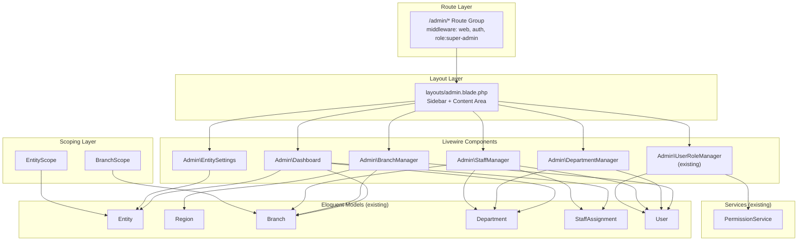
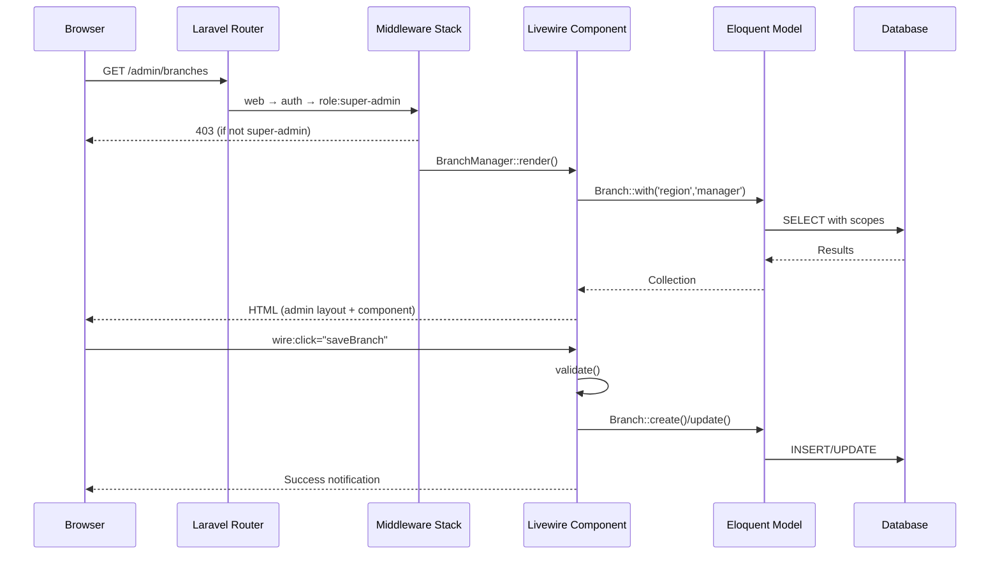
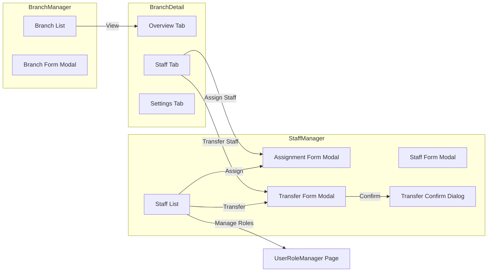
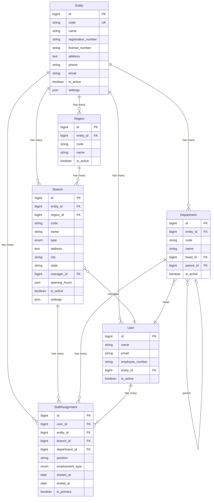

# Design Document: Organization Management Admin

## Overview

This design introduces a complete admin panel at `/admin/*` for the Ar-Rahnu system, enabling Super Admins to manage the organizational hierarchy (Entity, Region, Branch, Department, StaffAssignment) through Livewire 3 components. The admin panel follows the same Apple-style sidebar pattern established by `layouts/branch.blade.php` and `layouts/studio.blade.php`, and integrates with the existing Spatie RBAC layer (9 roles, 30+ permissions) and fully implemented Eloquent models.

The key design decisions are:
1. **Livewire full-page components** — each admin page is a Livewire component rendered as a full page with the admin layout, consistent with the Studio and Branch patterns.
2. **Modal-based CRUD** — create/edit forms use Livewire-driven modals (no separate routes), keeping the user in context.
3. **Laravel Global Scopes** — `EntityScope` and `BranchScope` are implemented as reusable global scopes applied via a trait, extending the existing `HasScoping` pattern.
4. **Reuse existing models** — no new database tables or migrations; all models (Entity, Branch, Department, Region, StaffAssignment, User) are already implemented.
5. **Single route group** — all admin routes live under `Route::prefix('admin')` with `role:super-admin` middleware.

## Architecture

### High-Level Architecture



### Request Flow



## Components and Interfaces

### Route Registration (routes/web.php)

All admin routes are registered in a single group:

```php
Route::prefix('admin')->middleware(['web', 'auth', 'role:super-admin'])->group(function () {
    Route::get('/',                    Admin\Dashboard::class)->name('admin.dashboard');
    Route::get('/branches',            Admin\BranchManager::class)->name('admin.branches');
    Route::get('/branches/{branch}',   Admin\BranchDetail::class)->name('admin.branches.show');
    Route::get('/departments',         Admin\DepartmentManager::class)->name('admin.departments');
    Route::get('/staff',               Admin\StaffManager::class)->name('admin.staff');
    Route::get('/entity',              Admin\EntitySettings::class)->name('admin.entity');
    Route::get('/users/{user}/roles',  Admin\UserRoleManager::class)->name('admin.users.roles');
});
```

Named routes use the `admin.` prefix. The existing `UserRoleManager` component is reused at its new route.

### Admin Layout (`resources/views/layouts/admin.blade.php`)

Follows the same structure as `layouts/branch.blade.php`:
- Fixed sidebar (260px) with navigation links
- Main content area with `{{ $slot }}` for Livewire components
- Sidebar sections: Dashboard, Organization (Branches, Departments), People (Staff, User Roles), Settings (Entity Settings)
- Active route highlighting via `request()->routeIs()`
- User profile display in sidebar footer with name and role
- Quick-access link to Studio dashboard

### Livewire Component Architecture

Each component is a full-page Livewire component that specifies `->layout('layouts.admin')` in its `render()` method.

#### 1. `Admin\Dashboard` (`app/Livewire/Admin/Dashboard.php`)

**Purpose:** Organizational overview with key metrics.

**Public Properties:**
- None (all data computed in render)

**Render Data:**
- `activeBranchCount` — `Branch::active()->count()`
- `totalStaffCount` — `User::active()->count()`
- `departmentCount` — `Department::active()->count()`
- `regionCount` — `Region::active()->count()`
- `branchTypeBreakdown` — grouped count by `type` column
- `employmentTypeBreakdown` — grouped count from active StaffAssignments
- `branchesWithStats` — branches with `activeStaffAssignments_count`, `manager` relation
- `recentAssignments` — StaffAssignment created/updated in last 30 days with `user`, `branch`, `department`

#### 2. `Admin\BranchManager` (`app/Livewire/Admin/BranchManager.php`)

**Purpose:** List, create, and edit branches.

**Public Properties:**
```php
public string $search = '';
public string $filterRegion = '';
public string $filterState = '';
public string $filterType = '';
public string $filterStatus = '';
public bool $showModal = false;
public ?int $editingBranchId = null;

// Form fields
public string $code = '';
public string $name = '';
public string $type = 'branch';
public ?int $region_id = null;
public string $address = '';
public string $city = '';
public string $state = '';
public string $postcode = '';
public string $phone = '';
public string $email = '';
public ?int $manager_id = null;
public array $opening_hours = [];
public bool $is_active = true;
```

**Key Methods:**
- `render()` — queries branches with filters, pagination, eager loads `region`, `manager`, `activeStaffAssignments`
- `create()` — opens modal with empty form
- `edit(int $branchId)` — opens modal with populated form
- `save()` — validates and creates/updates branch
- `toggleStatus(int $branchId)` — toggles `is_active`

**Validation Rules:**
- `code` — required, unique within entity (excluding current branch on edit)
- `type` — required, in: hq, branch, mini_branch; only one HQ per entity
- `manager_id` — nullable, must have `branch-manager` role
- Standard required fields: name, city, state

#### 3. `Admin\BranchDetail` (`app/Livewire/Admin/BranchDetail.php`)

**Purpose:** Tabbed detail view for a single branch.

**Public Properties:**
```php
public Branch $branch;
public string $activeTab = 'overview';
public array $settings = [];
```

**Tabs:**
- **Overview** — branch info, contact, operating hours, manager
- **Staff** — table of active staff assignments with name, position, employment type, start date; buttons to assign/transfer
- **Settings** — editable key-value pairs from `settings` JSON column

**Key Methods:**
- `mount(Branch $branch)` — route model binding
- `saveSettings()` — updates `settings` JSON
- `setTab(string $tab)` — switches active tab

#### 4. `Admin\DepartmentManager` (`app/Livewire/Admin/DepartmentManager.php`)

**Purpose:** List, create, edit departments with hierarchy display.

**Public Properties:**
```php
public bool $showModal = false;
public ?int $editingDepartmentId = null;
public string $code = '';
public string $name = '';
public string $description = '';
public ?int $head_id = null;
public ?int $parent_id = null;
public bool $is_active = true;
```

**Key Methods:**
- `render()` — loads root departments with recursive `children` eager loading
- `save()` — validates and creates/updates department
- `delete(int $departmentId)` — soft deletes if no active staff

**Hierarchy Display:** Root departments rendered first, children indented with CSS margin. Uses `Department::root()->with('children.children')` for up to 3 levels.

#### 5. `Admin\StaffManager` (`app/Livewire/Admin/StaffManager.php`)

**Purpose:** List, create, edit, assign, and transfer staff.

**Public Properties:**
```php
// List filters
public string $search = '';
public string $filterBranch = '';
public string $filterDepartment = '';
public string $filterRole = '';
public string $filterStatus = '';
public string $filterEmploymentType = '';

// Staff form
public bool $showStaffModal = false;
public ?int $editingUserId = null;
public string $staffName = '';
public string $staffEmail = '';
public string $employeeNumber = '';
public string $staffPhone = '';
public string $staffPassword = '';
public bool $staffIsActive = true;

// Assignment form
public bool $showAssignModal = false;
public ?int $assigningUserId = null;
public ?int $assignBranchId = null;
public ?int $assignDepartmentId = null;
public string $assignPosition = '';
public string $assignEmploymentType = 'permanent';
public string $assignStartDate = '';
public bool $assignIsPrimary = true;

// Transfer form
public bool $showTransferModal = false;
public ?int $transferringUserId = null;
public ?int $transferBranchId = null;
public ?int $transferDepartmentId = null;
public string $transferPosition = '';
public string $transferReason = '';
public string $transferEffectiveDate = '';
public bool $showTransferConfirm = false;
```

**Key Methods:**
- `render()` — queries users with filters, pagination, eager loads `primaryAssignment.branch`, `primaryAssignment.department`, `roles`
- `saveStaff()` — creates/updates User record
- `saveAssignment()` — creates StaffAssignment, handles primary flag
- `executeTransfer()` — ends current assignment, creates new one, preserves primary flag
- `resetPassword(int $userId)` — generates and sets new password
- `showAssignmentHistory(int $userId)` — loads all assignments for display

**Transfer Workflow:**
1. User clicks "Transfer" → `showTransferModal` opens with current assignment info
2. User fills new location, position, reason, effective date
3. Validation: destination ≠ current location
4. Confirmation dialog shown
5. On confirm: current assignment `ended_at` = effective date, new assignment created with `started_at` = effective date, `is_primary` inherited

#### 6. `Admin\EntitySettings` (`app/Livewire/Admin/EntitySettings.php`)

**Purpose:** View and edit entity details and settings.

**Public Properties:**
```php
public ?Entity $entity = null;
public string $entityName = '';
public string $registrationNumber = '';
public string $licenseNumber = '';
public string $address = '';
public string $phone = '';
public string $email = '';
public array $settings = [];
public bool $showCreateForm = false;
```

**Key Methods:**
- `mount()` — loads first entity (single-entity system) or shows create form
- `save()` — validates and updates entity details
- `saveSettings()` — updates `settings` JSON

### Component Interaction Diagram




## Data Models

No new database tables or migrations are needed. All models are fully implemented. This section documents the existing models and their relationships as used by the admin components.

### Existing Model Relationships



### Key Model Constraints (enforced in Livewire validation)

| Constraint | Model | Rule |
|---|---|---|
| Unique branch code per entity | Branch | `unique:branches,code,{id},id,entity_id,{entity_id}` |
| One HQ per entity | Branch | Custom rule checking `type=hq` count |
| Manager must have branch-manager role | Branch | Custom rule via `User::find($id)->hasRole('branch-manager')` |
| Unique department code per entity | Department | `unique:departments,code,{id},id,entity_id,{entity_id}` |
| Cannot delete dept with active staff | Department | Check `activeStaffAssignments()->count() === 0` |
| Unique employee number | User | `unique:users,employee_number` |
| Unique email | User | `unique:users,email` |
| Assignment: branch XOR department | StaffAssignment | Custom rule: exactly one of `branch_id` or `department_id` must be set |
| One primary assignment per user | StaffAssignment | Custom rule checking active primary count |
| Transfer destination ≠ current | StaffAssignment | Custom validation in transfer method |

### Organizational Scoping Implementation

Two new Laravel Global Scopes will be created as standalone classes:

**`App\Models\Scopes\EntityScope`**
```php
class EntityScope implements Scope
{
    public function apply(Builder $builder, Model $model): void
    {
        if (!auth()->check()) {
            $builder->whereRaw('1 = 0'); // empty result for unauthenticated
            return;
        }
        $user = auth()->user();
        if (!$user->hasRole('super-admin')) {
            $builder->where($model->getTable() . '.entity_id', $user->entity_id);
        }
    }
}
```

**`App\Models\Scopes\BranchScope`**
```php
class BranchScope implements Scope
{
    public function apply(Builder $builder, Model $model): void
    {
        if (!auth()->check()) {
            $builder->whereRaw('1 = 0');
            return;
        }
        $user = auth()->user();
        if (!$user->hasRole('super-admin')) {
            $accessibleIds = $user->getAccessibleBranches()->pluck('id');
            $builder->whereIn($model->getTable() . '.branch_id', $accessibleIds);
        }
    }
}
```

These scopes are applied via a `HasOrganizationScoping` trait that models can use. For the admin panel (super-admin only), these scopes effectively pass through without filtering. They become relevant when the system is extended to allow HQ Admin or Regional Manager access.

### State Management

All component state is managed through Livewire public properties. Key patterns:

- **Filter state** — public string properties bound to form inputs via `wire:model.live.debounce.300ms`
- **Modal state** — boolean `$showModal` properties toggled by methods
- **Form state** — individual public properties for each form field, reset via `$this->reset([...])` on modal close
- **Pagination** — Livewire's `WithPagination` trait with `$paginationTheme = 'tailwind'`
- **Flash messages** — `session()->flash()` for success/error notifications, rendered in layout


## Correctness Properties

*A property is a characteristic or behavior that should hold true across all valid executions of a system — essentially, a formal statement about what the system should do. Properties serve as the bridge between human-readable specifications and machine-verifiable correctness guarantees.*

### Property 1: Non-super-admin access denial

*For any* authenticated user who does not have the `super-admin` role, accessing any `/admin/*` route SHALL return a 403 Forbidden response.

**Validates: Requirements 1.4**

### Property 2: Branch filter correctness

*For any* set of branches and any combination of search term, region filter, state filter, type filter, and status filter, all branches returned by the BranchManager query SHALL match every applied filter criterion — the search term must appear in the branch code or name, and each dropdown filter value must match the corresponding branch attribute.

**Validates: Requirements 4.2, 4.3**

### Property 3: Branch code uniqueness invariant

*For any* entity and any branch code, if a branch with that code already exists in the entity, then creating or updating another branch to use the same code SHALL be rejected with a validation error.

**Validates: Requirements 5.2, 5.7**

### Property 4: One HQ per entity invariant

*For any* entity, after any sequence of branch create or update operations, at most one branch SHALL have `type = 'hq'`.

**Validates: Requirements 5.3**

### Property 5: Manager role validation

*For any* user selected as a branch manager, the branch save operation SHALL succeed only if that user has the `branch-manager` role.

**Validates: Requirements 5.4**

### Property 6: Settings JSON round-trip

*For any* valid key-value settings map (string keys, scalar or array values), saving the settings to a Branch or Entity `settings` column and then reading them back SHALL produce an equivalent map.

**Validates: Requirements 6.5, 12.3**

### Property 7: Department code uniqueness invariant

*For any* entity and any department code, if a department with that code already exists in the entity, then creating another department with the same code SHALL be rejected with a validation error.

**Validates: Requirements 7.4**

### Property 8: Department deletion guard

*For any* department, deletion SHALL succeed only if the department has zero active staff assignments (where `ended_at` is null and `started_at <= now`).

**Validates: Requirements 7.6**

### Property 9: Staff filter correctness

*For any* set of users and any combination of search term, branch filter, department filter, role filter, status filter, and employment type filter, all users returned by the StaffManager query SHALL match every applied filter criterion.

**Validates: Requirements 8.2, 8.3**

### Property 10: User uniqueness constraints

*For any* user, if a user with the same employee number or email already exists, then creating a new user with that employee number or email SHALL be rejected with a validation error.

**Validates: Requirements 9.2, 9.3**

### Property 11: Assignment branch XOR department

*For any* StaffAssignment, exactly one of `branch_id` or `department_id` SHALL be non-null. An assignment with both set or neither set SHALL be rejected.

**Validates: Requirements 10.2**

### Property 12: One primary assignment per user

*For any* user, after any sequence of assignment create, transfer, or update operations, at most one active assignment (where `ended_at` is null) SHALL have `is_primary = true`.

**Validates: Requirements 10.3**

### Property 13: Transfer workflow correctness

*For any* valid staff transfer (where destination differs from current location), the transfer operation SHALL: (a) set the old assignment's `ended_at` to the effective date, (b) create a new assignment with `started_at` equal to the effective date and the new location, and (c) if the old assignment was primary, the new assignment SHALL also be primary. A transfer where destination equals the current location SHALL be rejected.

**Validates: Requirements 11.2, 11.3, 11.4, 11.5**

### Property 14: EntityScope filtering

*For any* non-super-admin authenticated user, all records returned by an entity-scoped query SHALL have `entity_id` equal to the authenticated user's `entity_id`.

**Validates: Requirements 14.1**

### Property 15: BranchScope filtering

*For any* authenticated user, all records returned by a branch-scoped query SHALL have `branch_id` within the set returned by `getAccessibleBranches()` for that user.

**Validates: Requirements 14.2**

## Error Handling

### Validation Errors

All Livewire components use Laravel's built-in validation with `$this->validate()`. Validation errors are displayed inline next to form fields using Blade's `@error` directive. Key validation scenarios:

| Scenario | Component | Error Message |
|---|---|---|
| Duplicate branch code | BranchManager | "The code has already been taken." |
| Second HQ branch | BranchManager | "An HQ branch already exists for this entity." |
| Manager without role | BranchManager | "The selected manager must have the branch-manager role." |
| Duplicate dept code | DepartmentManager | "The code has already been taken." |
| Delete dept with staff | DepartmentManager | "Cannot delete department with active staff assignments." |
| Duplicate employee number | StaffManager | "The employee number has already been taken." |
| Duplicate email | StaffManager | "The email has already been taken." |
| Both branch and dept set | StaffManager | "Assignment must be to either a branch or department, not both." |
| Transfer to same location | StaffManager | "Transfer destination must differ from current assignment." |

### Authorization Errors

- All admin routes are protected by `role:super-admin` middleware. Unauthorized access returns 403.
- The existing `UserRoleManager` component has its own `users.assign-roles` permission check in `mount()`.

### Database Errors

- Soft deletes prevent accidental data loss on Entity, Branch, Department, Region.
- Foreign key constraints prevent orphaned records.
- Database transactions wrap multi-step operations (transfer workflow) to ensure atomicity.

### Empty States

- Dashboard with no branches shows a "Create your first branch" prompt.
- Entity settings with no entity shows a create form.
- Staff/branch/department lists with no results show "No records found" messages.

## Testing Strategy

### Unit Tests (PHPUnit)

Example-based tests for specific scenarios:

- **Route tests:** Verify admin routes exist, return correct responses for authenticated/unauthenticated users, and enforce role middleware.
- **Component render tests:** Verify each Livewire component renders with correct data and layout.
- **CRUD happy path tests:** Verify create, edit, and delete operations work with valid data.
- **UI element tests:** Verify modals, tabs, badges, and navigation links render correctly.
- **Edge case tests:** Empty states, boundary conditions (e.g., deleting last branch).

### Property-Based Tests (PHPUnit + `spatie/phpunit-watcher` or custom generators)

Since this is a Laravel/PHP project, property-based tests will use the **PhpQuickCheck** library (`steos/quickcheck`) or a lightweight custom approach with Laravel's factory system generating random valid inputs.

Each property test:
- Runs minimum 100 iterations
- References its design document property via a comment tag
- Uses Laravel model factories to generate random valid data

**Tag format:** `Feature: org-management-admin, Property {number}: {title}`

Key property tests:
- **Filter correctness** (Properties 2, 9): Generate random branches/users with random attributes, apply random filter combinations, verify all results match.
- **Uniqueness constraints** (Properties 3, 7, 10): Generate random codes/emails, attempt duplicate creation, verify rejection.
- **Transfer workflow** (Property 13): Generate random staff with assignments, execute transfers to random valid destinations, verify old assignment ended and new one created correctly.
- **Scoping** (Properties 14, 15): Generate users with different roles and entity assignments, execute scoped queries, verify results are correctly filtered.
- **Settings round-trip** (Property 6): Generate random JSON-compatible key-value maps, save and reload, verify equality.
- **Assignment invariants** (Properties 11, 12): Generate random assignment operations, verify XOR and primary constraints hold.

### Integration Tests

- **Transfer atomicity:** Verify that if the new assignment creation fails, the old assignment is not ended (database transaction rollback).
- **Livewire reactivity:** Verify that filter changes trigger component re-renders without full page reload.
- **Route model binding:** Verify that `/admin/users/{user}/roles` correctly resolves the User model and passes it to UserRoleManager.

### Test File Structure

```
tests/
├── Feature/
│   └── Admin/
│       ├── AdminRouteTest.php
│       ├── DashboardTest.php
│       ├── BranchManagerTest.php
│       ├── BranchDetailTest.php
│       ├── DepartmentManagerTest.php
│       ├── StaffManagerTest.php
│       ├── EntitySettingsTest.php
│       └── UserRoleManagerRouteTest.php
├── Unit/
│   └── Admin/
│       ├── EntityScopeTest.php
│       ├── BranchScopeTest.php
│       └── TransferWorkflowTest.php
└── Property/
    └── Admin/
        ├── BranchFilterPropertyTest.php
        ├── StaffFilterPropertyTest.php
        ├── UniquenessPropertyTest.php
        ├── TransferPropertyTest.php
        ├── ScopingPropertyTest.php
        ├── SettingsRoundTripPropertyTest.php
        └── AssignmentInvariantPropertyTest.php
```
