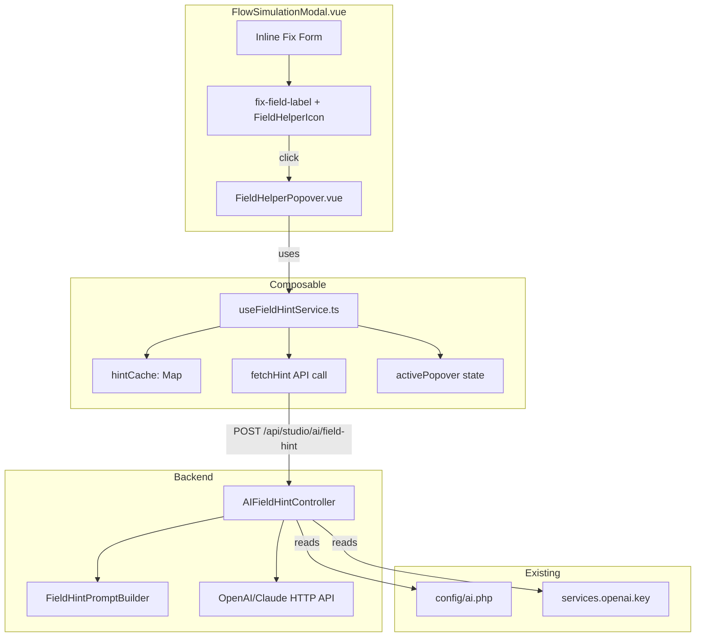
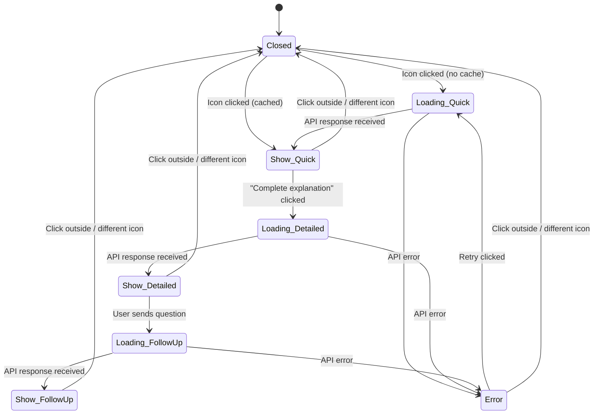

# Design Document: Preflight AI Field Helper

## Overview

This feature adds AI-powered contextual help to every field in the Inline Fix Form within the Simulation Preflight Check modal. A small ℹ️ icon appears next to each field label. Clicking it opens a dark-glass popover that fetches an AI-generated "quick hint" (20–50 tokens) explaining the field's purpose, expected value, and a brief example. The user can then request a detailed explanation or ask a follow-up question — all within the same popover.

The design introduces two new pieces:

1. **Frontend**: A `FieldHelperPopover.vue` component and a `useFieldHintService` composable that manages API calls, in-memory caching (keyed by `nodeType+fieldKey`), and popover state.
2. **Backend**: A new `AIFieldHintController` with a single `POST /api/studio/ai/field-hint` endpoint that constructs an Ar-Rahnu-domain-aware prompt and calls the existing OpenAI/Claude API via the same HTTP client pattern used by `AIUIGenerator`.

### Key Design Decisions

1. **Dedicated controller, not extending AIUIGenerator** — The field hint endpoint has fundamentally different concerns (short text responses, no JSON schema validation, no UI compliance scoring). A lean `AIFieldHintController` avoids coupling to the heavy `AIUIGenerator` pipeline while reusing the same `config('services.openai.key')` and `config('ai.primary_model')` settings.

2. **Separate `FieldHintPromptBuilder` service** — Prompt construction is extracted into its own class so it can be unit-tested independently. It builds system prompts with Ar-Rahnu domain context and per-node-type/field-key specifics (e.g., payment provider credential guidance).

3. **In-memory cache scoped to modal session** — Quick hints are cached in a `Map<string, string>` inside the composable. The cache is created when the composable is instantiated (modal mount) and garbage-collected when the modal unmounts. Detailed explanations and follow-up answers are never cached.

4. **Single popover instance** — Only one popover is open at a time. Clicking a different ℹ️ icon closes the current popover and opens a new one. This avoids z-index stacking issues and keeps the UI clean.

5. **Progressive disclosure (3 levels)** — Level 1: quick hint (auto-fetched on icon click). Level 2: detailed explanation (on "Complete explanation" button click). Level 3: follow-up question (text input appears after detailed explanation). Each level appends content below the previous, keeping context visible.

## Architecture



### Popover State Machine



## Components and Interfaces

### 1. `useFieldHintService` — Composable

```typescript
// resources/js/builders/flow/composables/useFieldHintService.ts

interface HintRequest {
  nodeType: string
  fieldKey: string
  fieldLabel: string
  mode: 'quick' | 'detailed'
  userQuestion?: string
}

interface HintResponse {
  hint: string
}

interface PopoverState {
  visible: boolean
  anchorEl: HTMLElement | null
  nodeType: string
  fieldKey: string
  fieldLabel: string
  quickHint: string | null
  detailedHint: string | null
  followUpAnswer: string | null
  loading: boolean
  error: string | null
}

function useFieldHintService() {
  const cache: Map<string, string>  // key = `${nodeType}::${fieldKey}`
  const popover: Ref<PopoverState>

  async function openHint(
    anchorEl: HTMLElement,
    nodeType: string,
    fieldKey: string,
    fieldLabel: string
  ): Promise<void>

  async function fetchDetailed(): Promise<void>

  async function askFollowUp(question: string): Promise<void>

  async function retry(): Promise<void>

  function closePopover(): void

  return { popover, openHint, fetchDetailed, askFollowUp, retry, closePopover }
}
```

**Cache key format**: `${nodeType}::${fieldKey}` (e.g., `notification::template_key`). Only quick hints are cached. The cache `Map` is created fresh each time the composable is instantiated.

**API call**: Uses `fetch()` with the CSRF token from `<meta name="csrf-token">`, matching the existing pattern in `FlowSimulationModal.vue`.

### 2. `FieldHelperPopover.vue` — Component

A single-file Vue component rendered inside `FlowSimulationModal.vue` via a `<Teleport to="body">` to escape overflow clipping.

```
Props:
  - popover: PopoverState (from composable)

Emits:
  - fetch-detailed
  - ask-follow-up (payload: string)
  - retry
  - close
```

**Positioning**: Uses `getBoundingClientRect()` on `anchorEl` to calculate position. Prefers below-right of the icon; auto-flips to above or left if the popover would overflow the viewport. Max width 320px.

**Sections rendered conditionally**:
1. Loading spinner (when `loading && !quickHint`)
2. Quick hint text (when `quickHint` is set)
3. "Complete explanation" button (when `quickHint` is set and `detailedHint` is null)
4. Loading spinner for detailed (when `loading && quickHint && !detailedHint`)
5. Detailed explanation text (when `detailedHint` is set)
6. Follow-up input + Send button (when `detailedHint` is set)
7. Loading spinner for follow-up (when `loading && detailedHint && !followUpAnswer`)
8. Follow-up answer text (when `followUpAnswer` is set)
9. Error state with retry button (when `error` is set)

### 3. `AIFieldHintController` — Laravel Controller

```php
// app/Http/Controllers/Api/Studio/AIFieldHintController.php

class AIFieldHintController extends Controller
{
    public function hint(Request $request): JsonResponse
    {
        // 1. Validate request
        // 2. Rate limit check (30/min per user)
        // 3. Build prompt via FieldHintPromptBuilder
        // 4. Call OpenAI/Claude API
        // 5. Return { "hint": "..." }
    }
}
```

**Request validation**:
```php
$request->validate([
    'nodeType'     => 'required|string|max:50',
    'fieldKey'     => 'required|string|max:100',
    'fieldLabel'   => 'required|string|max:200',
    'mode'         => 'required|string|in:quick,detailed',
    'userQuestion' => 'nullable|string|max:500',
]);
```

**Rate limiting**: 30 requests per minute per authenticated user, using Laravel's `RateLimiter` facade with key `field-hint:{userId}`.

**AI call**: Direct `Http::withToken()` call (same pattern as `AIUIGenerator::callAI`) but with:
- `max_tokens`: 60 for `quick` mode, 500 for `detailed` mode
- `temperature`: 0.3 (lower for more factual responses)
- `timeout`: 15 seconds
- No `response_format: json_object` — plain text response
- No UI compliance validation

**Error responses**:
- 422: Validation errors
- 429: Rate limit exceeded
- 504: AI API timeout (15s)
- 500: AI API failure

### 4. `FieldHintPromptBuilder` — Service

```php
// app/Studio/AI/FieldHintPromptBuilder.php

class FieldHintPromptBuilder
{
    public function buildSystemPrompt(): string
    // Returns Ar-Rahnu domain context prompt

    public function buildUserPrompt(
        string $nodeType,
        string $fieldKey,
        string $fieldLabel,
        string $mode,
        ?string $userQuestion = null
    ): string
    // Returns the user prompt with field context
}
```

**System prompt content** includes:
- Ar-Rahnu (Islamic pawnbroking) flow builder context
- All 13+ node types and their purposes (trigger, command, decision, approval, notification, document, gl_action, formula, payment_gateway, vault_action, api_request, tawarruq_calc, generate_pdf)
- Instruction to respond in English
- Instruction to provide practical Ar-Rahnu domain examples

**User prompt** varies by mode:
- `quick`: "Explain the field '{fieldLabel}' (key: {fieldKey}) in a {nodeType} node. Respond in 20-50 tokens. Include: purpose, expected value type, one brief example."
- `detailed`: "Provide a comprehensive explanation of the field '{fieldLabel}' (key: {fieldKey}) in a {nodeType} node. Include: purpose, expected value format, common values, how it connects to other nodes, and practical Ar-Rahnu examples."
- `detailed` + `userQuestion`: Appends "The user asks: {userQuestion}" to the detailed prompt.

**Payment provider context**: When `nodeType === 'payment_gateway'` and `fieldKey` starts with `credentials.`, the prompt builder appends provider-specific guidance for Billplz, Bayarcash, ToyyibPay, Stripe, and Chip.

### 5. `FlowSimulationModal.vue` — Changes

Minimal changes to the existing modal:
- Import and instantiate `useFieldHintService` composable
- Add ℹ️ icon button next to each `<label class="fix-field-label">` in the inline fix form
- Render `<FieldHelperPopover>` component (single instance, controlled by composable state)
- Add click-outside handler to close popover

### 6. Route Registration

```php
// In routes/web.php, inside the api/studio middleware group:
Route::post('ai/field-hint', [AIFieldHintController::class, 'hint'])
    ->middleware('permission:flows.edit');
```

## Data Models

### HintRequest (Frontend → Backend)

| Field | Type | Required | Description |
|-------|------|----------|-------------|
| `nodeType` | `string` | Yes | Node type (e.g., `notification`, `payment_gateway`) |
| `fieldKey` | `string` | Yes | Config field key (e.g., `template_key`, `credentials.api_key`) |
| `fieldLabel` | `string` | Yes | Human-readable field label |
| `mode` | `string` | Yes | `quick` or `detailed` |
| `userQuestion` | `string` | No | Follow-up question text (max 500 chars) |

### HintResponse (Backend → Frontend)

| Field | Type | Description |
|-------|------|-------------|
| `hint` | `string` | AI-generated hint text |

### PopoverState (Frontend internal)

| Field | Type | Description |
|-------|------|-------------|
| `visible` | `boolean` | Whether the popover is shown |
| `anchorEl` | `HTMLElement \| null` | The ℹ️ icon element for positioning |
| `nodeType` | `string` | Current field's node type |
| `fieldKey` | `string` | Current field's key |
| `fieldLabel` | `string` | Current field's label |
| `quickHint` | `string \| null` | Cached or fetched quick hint |
| `detailedHint` | `string \| null` | Detailed explanation (not cached) |
| `followUpAnswer` | `string \| null` | Follow-up response (not cached) |
| `loading` | `boolean` | Whether an API call is in progress |
| `error` | `string \| null` | Error message if API call failed |

### HintCache (Frontend internal)

```typescript
// In-memory Map, scoped to modal session
Map<string, string>
// Key: `${nodeType}::${fieldKey}`
// Value: quick hint text
// Example: "notification::template_key" → "The template key identifies..."
```

No new database tables are needed. All state is ephemeral — the cache lives in the composable's closure and is garbage-collected when the modal unmounts.


## Correctness Properties

*A property is a characteristic or behavior that should hold true across all valid executions of a system — essentially, a formal statement about what the system should do. Properties serve as the bridge between human-readable specifications and machine-verifiable correctness guarantees.*

### Property 1: Request validation accepts valid payloads and rejects invalid ones

*For any* JSON request payload, the `Field_Hint_Endpoint` validation SHALL accept the payload if and only if it contains `nodeType` (string), `fieldKey` (string), `fieldLabel` (string), and `mode` (string, one of `quick` or `detailed`), with an optional `userQuestion` (string). *For any* payload missing a required field or containing an invalid `mode` value, the endpoint SHALL return a 422 status code with validation error details.

**Validates: Requirements 2.4, 7.2, 7.3**

### Property 2: Quick hint cache round-trip

*For any* `nodeType` and `fieldKey` combination, if a quick hint has been successfully fetched and stored in the `Hint_Cache`, then a subsequent call to `openHint` with the same `nodeType` and `fieldKey` SHALL return the cached hint text immediately and SHALL NOT trigger a new API call. The cache key `${nodeType}::${fieldKey}` SHALL map to the exact hint text that was originally received.

**Validates: Requirements 3.1, 3.2**

### Property 3: Only quick hints are cached

*For any* sequence of API interactions (quick hint fetch, detailed explanation fetch, follow-up question), the `Hint_Cache` SHALL only ever contain entries from successful quick hint responses. *For any* detailed explanation or follow-up answer received, the cache contents SHALL remain unchanged — no new entries added and no existing entries modified.

**Validates: Requirements 4.5, 5.5**

### Property 4: Popover viewport containment

*For any* anchor element position (x, y) and *for any* viewport dimensions (width, height), the computed popover position SHALL place the popover rectangle (up to 320px wide) entirely within the viewport boundaries (0 ≤ left, top ≥ 0, right ≤ viewport width, bottom ≤ viewport height).

**Validates: Requirements 6.2**

### Property 5: Prompt construction includes required context

*For any* valid combination of `nodeType`, `fieldKey`, `fieldLabel`, `mode`, and optional `userQuestion`:
- The built system prompt SHALL contain Ar-Rahnu domain context including references to Islamic pawnbroking and the flow builder application.
- When `mode` is `quick`, the user prompt SHALL contain a token limit instruction (20–50 tokens).
- When `mode` is `detailed`, the user prompt SHALL contain an instruction for comprehensive explanation.
- When `userQuestion` is provided, the user prompt SHALL contain the exact user question text.
- When `nodeType` is `payment_gateway` and `fieldKey` starts with `credentials.`, the prompt SHALL contain provider-specific context (Billplz, Bayarcash, ToyyibPay, Stripe, or Chip).

**Validates: Requirements 7.5, 7.6, 7.7, 7.8, 8.1, 8.2, 8.3, 8.4**

## Error Handling

### Backend Errors

| Scenario | HTTP Status | Response | Frontend Display |
|----------|-------------|----------|------------------|
| Invalid request payload | 422 | `{ "errors": { ... } }` | "Unable to load hint. Please try again." + retry button |
| Rate limit exceeded (30/min) | 429 | `{ "message": "Too many requests..." }` | "Too many requests. Please wait a moment." |
| AI API timeout (>15s) | 504 | `{ "message": "Request timed out..." }` | "Unable to load hint. Please try again." + retry button |
| AI API failure | 500 | `{ "message": "..." }` | "Unable to load hint. Please try again." + retry button |
| Unauthenticated | 302/401 | Redirect to login | N/A (session expired) |

### Frontend Errors

| Scenario | Handling |
|----------|----------|
| Network error (endpoint unreachable) | Display "Unable to load hint. Please try again." with retry button |
| Popover anchor element removed from DOM | Close popover gracefully |
| User clicks retry | Re-attempt the last failed API call with the same parameters |
| Multiple rapid clicks on same icon | Debounce — ignore clicks while a request is in-flight |

### Resilience Patterns

- **No cascade failure**: AI hint failures never block the preflight fix form. The ℹ️ icon and popover are purely additive — the form remains fully functional without hints.
- **Graceful degradation**: If the AI service is completely down, users see error messages with retry buttons but can still fill in fields manually.
- **Rate limit feedback**: The 429 response triggers a distinct message ("Too many requests") so users understand the temporary nature of the limitation.

## Testing Strategy

### Unit Tests (Example-Based)

**Frontend:**
- Helper icon renders next to each field label in the fix form
- Clicking icon opens popover, clicking outside closes it
- Clicking different icon closes current popover and opens new one
- Loading spinner displays during API call
- Quick hint text displays after successful fetch
- "Complete explanation" button appears after quick hint
- Detailed explanation appends below quick hint
- Follow-up input and Send button appear after detailed explanation
- Error message and retry button display on API failure
- Rate limit error shows specific "Too many requests" message
- Retry button re-triggers the API call
- Cache clears when modal is unmounted and remounted

**Backend:**
- Endpoint returns 200 with `{ "hint": "..." }` for valid request (mocked AI)
- Endpoint returns 422 for missing required fields
- Endpoint returns 429 after 30 requests in one minute
- Endpoint returns 504 when AI API times out
- Endpoint returns 500 when AI API fails
- Endpoint requires authentication (unauthenticated request redirected)

### Property-Based Tests

Using [fast-check](https://github.com/dubzzz/fast-check) for frontend JavaScript tests and [PHPUnit with data providers](https://docs.phpunit.de/en/11.5/) for backend PHP tests. Each property test runs a minimum of 100 iterations.

- **Property 1** — Tag: `Feature: preflight-ai-field-helper, Property 1: Request validation accepts valid payloads and rejects invalid ones`
  - Generator: Random objects with random subsets of required fields present/absent, random `mode` values (valid and invalid strings), random string lengths
  - Assertion: Valid payloads pass validation; invalid payloads return 422 with appropriate error keys

- **Property 2** — Tag: `Feature: preflight-ai-field-helper, Property 2: Quick hint cache round-trip`
  - Generator: Random `nodeType` and `fieldKey` strings, random hint text
  - Assertion: After storing a hint in cache, calling `openHint` with the same nodeType+fieldKey returns the cached text and does not trigger `fetch()`

- **Property 3** — Tag: `Feature: preflight-ai-field-helper, Property 3: Only quick hints are cached`
  - Generator: Random sequences of quick/detailed/follow-up operations with random nodeType+fieldKey combinations
  - Assertion: After any sequence of operations, cache only contains entries from quick hint responses; cache size never increases from detailed or follow-up calls

- **Property 4** — Tag: `Feature: preflight-ai-field-helper, Property 4: Popover viewport containment`
  - Generator: Random anchor positions (x: 0–2000, y: 0–2000), random viewport dimensions (width: 320–2560, height: 320–1440)
  - Assertion: Computed popover position keeps the entire popover rectangle within viewport bounds

- **Property 5** — Tag: `Feature: preflight-ai-field-helper, Property 5: Prompt construction includes required context`
  - Generator: Random `nodeType` from known types, random `fieldKey`, random `fieldLabel`, random `mode` (quick/detailed), optional random `userQuestion`
  - Assertion: System prompt contains "Ar-Rahnu" and "Islamic pawnbroking"; user prompt contains mode-appropriate instructions; user question appears in prompt when provided; payment_gateway + credentials.* triggers provider context

### Integration Tests

- **End-to-end hint flow**: Click ℹ️ icon → see loading → see quick hint → click "Complete explanation" → see detailed → type follow-up → see answer
- **Cache integration**: Click icon → get hint → close popover → click same icon → hint appears instantly (no network call in browser devtools)
- **Error recovery**: Disconnect AI service → click icon → see error → reconnect → click retry → see hint
- **Rate limiting**: Rapidly click 31 different icons → verify 429 response on the 31st
