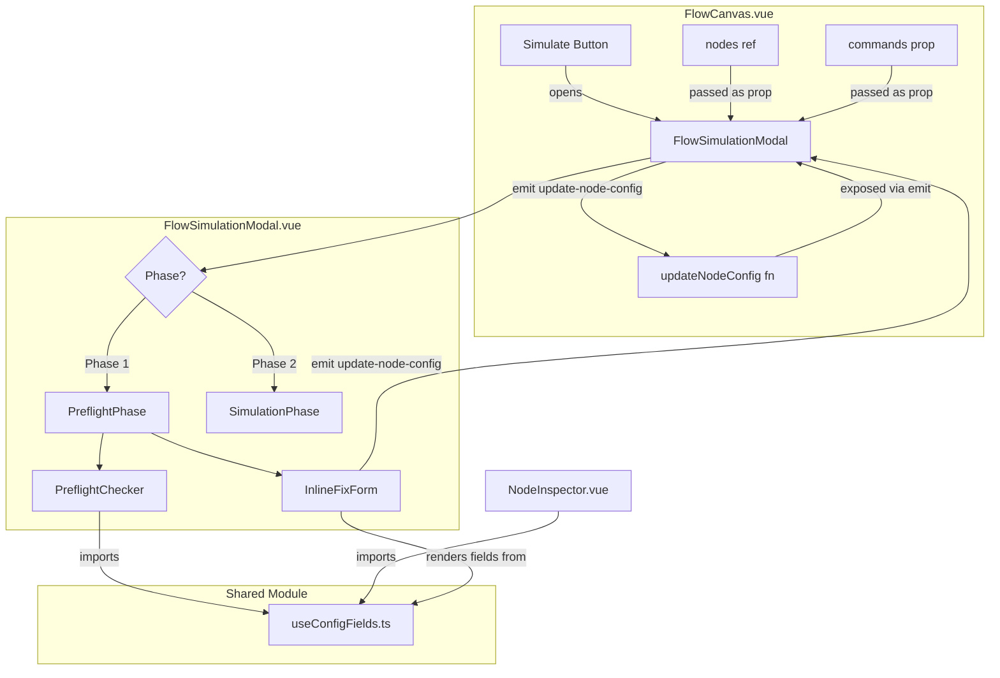
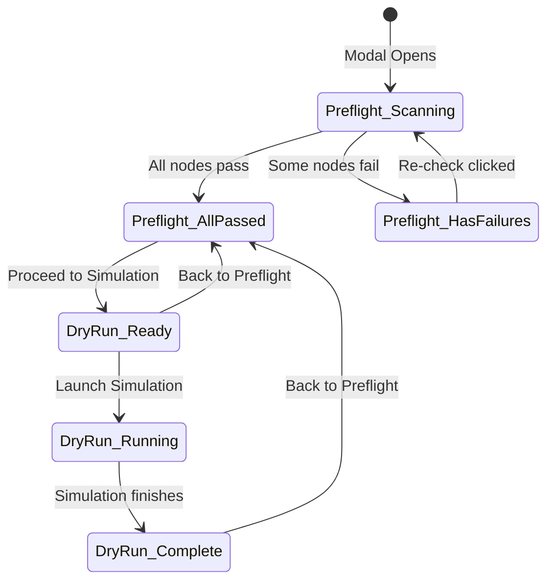

# Design Document: Simulation Preflight Check

## Overview

This feature transforms the existing single-phase `FlowSimulationModal` into a two-phase modal: a **preflight readiness check** followed by the existing **dry-run simulation**. When the user clicks "Simulate", the modal opens to Phase 1 (preflight), which sequentially scans every node in the flow canvas, validates config completeness against the shared field definitions, and presents results with pass/fail indicators. Failed nodes are collected into an inline fix form so the user can fill missing fields without leaving the modal. Only after all nodes pass does the "Proceed to Simulation" button appear, transitioning to Phase 2 (the existing dry-run UI).

The core design decision is to **extract the `configFields` logic from `NodeInspector.vue` into a shared utility module** (`useConfigFields.ts`) so that both the inspector and the preflight checker consume the same source of truth. This eliminates duplication and ensures any new node type automatically gets preflight validation.

### Key Design Decisions

1. **Client-side preflight only** — The preflight check runs entirely in the browser using the same field definitions as `NodeInspector`. No new backend endpoint is needed because the validation rules are already defined in the frontend `configFields` computed. The backend `FlowValidator` remains for structural validation (trigger/end presence, orphans, cycles).

2. **Shared utility extraction** — Rather than duplicating the large `configFields` switch-case, we extract it into a composable `useConfigFields(nodeType, config, commands)` that returns the field definitions array. Both `NodeInspector` and the preflight checker import this.

3. **Sequential animated scan** — Nodes are scanned one-by-one with a configurable delay (default ~300ms) to create an "agent-like" scanning animation. This is purely cosmetic — the actual validation per node is synchronous and instant.

4. **Inline fix form with writeback** — The fix form renders the same field types (select, text, textarea, json, number) as the inspector. On save, it emits update events that call `updateNodeConfig()` on `FlowCanvas`, setting `isDirty = true` to trigger auto-save.

## Architecture



### Phase State Machine



## Components and Interfaces

### 1. `useConfigFields(nodeType, config, commands)` — Shared Utility

Extracted from `NodeInspector.vue`'s `configFields` computed. Pure function, no Vue reactivity dependency.

```typescript
// resources/js/builders/flow/composables/useConfigFields.ts

interface ConfigFieldDef {
  key: string
  label: string
  type: 'select' | 'text' | 'textarea' | 'json' | 'number' | 'divider'
  options?: string[] | { class: string; name: string; domain: string }[]
  placeholder?: string
}

function getConfigFields(
  nodeType: string,
  config: Record<string, any>,
  commands: any[]
): ConfigFieldDef[]
```

**Returns**: The same field definitions array currently produced by the `configFields` computed in `NodeInspector.vue`. The switch-case logic moves here verbatim.

### 2. `usePreflightChecker` — Composable

```typescript
// resources/js/builders/flow/composables/usePreflightChecker.ts

interface PreflightNodeResult {
  nodeId: string
  nodeKey: string
  label: string
  nodeType: string
  passed: boolean
  missingFields: ConfigFieldDef[]  // fields that are empty/missing
}

interface PreflightResult {
  totalScanned: number
  totalPassed: number
  totalFailed: number
  nodeResults: PreflightNodeResult[]
}

function usePreflightChecker() {
  const isScanning: Ref<boolean>
  const scanProgress: Ref<number>          // 0..totalNodes
  const currentNode: Ref<{ label: string; nodeType: string } | null>
  const results: Ref<PreflightResult | null>
  const completedNodes: Ref<PreflightNodeResult[]>  // incrementally populated during scan

  async function runScan(
    nodes: VueFlowNode[],
    commands: any[],
    delayMs?: number  // default 300
  ): Promise<PreflightResult>

  function checkNode(
    node: VueFlowNode,
    commands: any[]
  ): PreflightNodeResult

  return { isScanning, scanProgress, currentNode, results, completedNodes, runScan, checkNode }
}
```

**Validation logic per node**: For each node, call `getConfigFields(nodeType, config, commands)` to get the required fields. For each field (excluding `type: 'divider'`), check if the config value is populated. A field is "missing" if:
- For string fields: value is `undefined`, `null`, or empty string `''`
- For number fields: value is `undefined` or `null`
- For json fields: value is `undefined`, `null`, or empty object `{}`

**Conditional fields**: The `getConfigFields` function already handles conditional fields (e.g., provider-specific credentials for `payment_gateway`, auth-type-specific fields for `api_request`). Since it receives the current config, it only returns fields that are relevant given the current config state. This means the preflight checker automatically validates conditional fields correctly.

### 3. `FlowSimulationModal.vue` — Redesigned

The modal becomes a phase-switching container:

```
Props (new/changed):
  - show: Boolean
  - flowId: String|Number
  - versionId: String|Number
  - flowKey: String
  - nodes: Array          // NEW — the reactive nodes array from FlowCanvas
  - commands: Array       // NEW — available commands list

Emits (new):
  - close
  - update-node-config    // NEW — { nodeId, field, value } for writeback
```

Internal state:
- `phase: 'preflight' | 'simulation'` — starts as `'preflight'`
- Uses `usePreflightChecker` composable for scan state
- On open, automatically calls `runScan()`

### 4. Inline Fix Form (within FlowSimulationModal)

Renders when `results.totalFailed > 0`. Groups failed nodes by `nodeId`, shows node label + type as section header, and renders each missing field using the same field type definitions.

**Field rendering**: Uses the same `type` from `ConfigFieldDef`:
- `select` with string options → `<select>` dropdown
- `select` with `command_class` key → `<select>` with command objects
- `text` → `<input type="text">`
- `textarea` → `<textarea>`
- `json` → `<textarea>` with JSON formatting
- `number` → `<input type="number">`

**Save & Re-check flow**:
1. User fills in missing fields
2. Clicks "Save & Re-check"
3. For each filled field, emit `update-node-config` with `{ nodeId, key, value }`
4. `FlowCanvas` handles the emit by calling `updateNodeConfig()` pattern with dot-notation support
5. Preflight re-runs automatically after writeback

### 5. `FlowCanvas.vue` — Changes

- Pass `nodes` and `commands` as props to `FlowSimulationModal`
- Handle `update-node-config` emit from the modal:

```javascript
function handleModalConfigUpdate({ nodeId, key, value }) {
  const nodeIdx = nodes.value.findIndex(n => n.id === nodeId)
  if (nodeIdx === -1) return

  const config = { ...nodes.value[nodeIdx].data.config }

  // Dot-notation support (e.g., "credentials.api_key")
  if (key.includes('.')) {
    const [branch, leaf] = key.split('.')
    if (!config[branch]) config[branch] = {}
    config[branch][leaf] = value
  } else {
    config[key] = value
  }

  nodes.value[nodeIdx].data = {
    ...nodes.value[nodeIdx].data,
    config,
  }
  isDirty.value = true
}
```

## Data Models

### PreflightNodeResult

| Field | Type | Description |
|-------|------|-------------|
| `nodeId` | `string` | Vue Flow node ID |
| `nodeKey` | `string` | Business key (e.g., `n_abc123`) |
| `label` | `string` | Human-readable node label |
| `nodeType` | `string` | Node type (trigger, command, etc.) |
| `passed` | `boolean` | Whether all required fields are populated |
| `missingFields` | `ConfigFieldDef[]` | Array of field definitions that are missing values |

### PreflightResult

| Field | Type | Description |
|-------|------|-------------|
| `totalScanned` | `number` | Total nodes scanned |
| `totalPassed` | `number` | Nodes with complete config |
| `totalFailed` | `number` | Nodes with missing fields |
| `nodeResults` | `PreflightNodeResult[]` | Per-node results in scan order |

### ConfigFieldDef

| Field | Type | Description |
|-------|------|-------------|
| `key` | `string` | Config key, supports dot-notation (e.g., `credentials.api_key`) |
| `label` | `string` | Human-readable field label |
| `type` | `string` | Field type: `select`, `text`, `textarea`, `json`, `number`, `divider` |
| `options` | `string[] \| object[]` | Options for select fields |
| `placeholder` | `string` | Placeholder text |

### InlineFixFormData

```typescript
// Keyed by nodeId, each entry holds the user-entered values for missing fields
Record<string, Record<string, any>>
// Example:
{
  "n_abc123": {
    "command_class": "App\\Commands\\FetchCustomerCommand",
    "mapping.customer_id": "$.payload.customer_id"
  }
}
```

No new database tables or backend models are needed. All preflight state is ephemeral and lives in the modal's Vue component state.


## Correctness Properties

*A property is a characteristic or behavior that should hold true across all valid executions of a system — essentially, a formal statement about what the system should do. Properties serve as the bridge between human-readable specifications and machine-verifiable correctness guarantees.*

### Property 1: Preflight validation detects missing required fields

*For any* node type and *for any* config object, the preflight checker SHALL report a field as missing if and only if that field is required by `getConfigFields` for that node type and the field's value in the config is empty (undefined, null, empty string, or empty object for json fields). A node passes preflight if and only if it has zero missing fields.

This covers all 13+ node types including conditional fields (e.g., provider-specific credentials for `payment_gateway`, auth-type-specific fields for `api_request`). The property holds because `getConfigFields` already encodes the conditional logic — it only returns fields relevant to the current config state.

**Validates: Requirements 3.2, 3.3, 3.4, 3.5, 3.6, 3.7, 3.8, 3.9, 3.10, 3.11, 3.12, 3.13, 3.14, 3.15, 3.16, 3.17**

### Property 2: Config field definition consistency after extraction

*For any* valid node type, *for any* config object, and *for any* commands array, calling `getConfigFields(nodeType, config, commands)` from the shared utility module SHALL return the same field definitions array (same keys, labels, types, and options) as the original inline `configFields` computed in `NodeInspector` would have produced for the same inputs.

This is a round-trip/equivalence property ensuring the extraction refactor preserves behavior.

**Validates: Requirements 3.1, 7.2, 7.3**

### Property 3: Preflight summary counts are consistent with node results

*For any* `PreflightResult`, `totalScanned` SHALL equal the length of `nodeResults`, `totalPassed` SHALL equal the count of entries where `passed === true`, and `totalFailed` SHALL equal the count of entries where `passed === false`. Additionally, `totalPassed + totalFailed === totalScanned`.

**Validates: Requirements 4.1**

### Property 4: Writeback correctly updates config at flat and nested paths

*For any* node ID, *for any* config key (including dot-notation keys like `credentials.api_key`), and *for any* value, after the writeback function executes, reading the config at that key path SHALL return the written value. For dot-notation keys `"a.b"`, the config object SHALL have `config.a.b === value`. For flat keys, `config[key] === value`. Existing config values at other keys SHALL remain unchanged.

**Validates: Requirements 5.6, 8.1, 8.2**

### Property 5: Inline form renders correct field types matching ConfigFieldDef

*For any* `ConfigFieldDef` with type in `{select, text, textarea, json, number}`, the inline fix form SHALL render an input element whose type matches the field definition. For `select` fields, the rendered options SHALL match the `options` array in the field definition exactly (same values, same order).

**Validates: Requirements 5.3, 5.4**

## Error Handling

### Preflight Scan Errors

| Scenario | Handling |
|----------|----------|
| Node has no `data.nodeType` | Skip node, log warning in console, do not count as failure |
| Node has no `data.config` | Treat as empty config `{}` — all required fields will be reported missing |
| `getConfigFields` returns empty array (e.g., `end` node) | Node automatically passes (no required fields) |
| Scan interrupted (modal closed mid-scan) | Cancel the async scan loop, discard partial results |

### Inline Fix Form Errors

| Scenario | Handling |
|----------|----------|
| User enters invalid JSON in a `json` field | Show inline validation error, prevent save for that field |
| Writeback target node not found in `nodes` array | Display error toast identifying the node, skip that node's updates |
| User leaves a field empty and clicks Save | Allow save — the re-check will catch remaining missing fields |

### Phase Transition Errors

| Scenario | Handling |
|----------|----------|
| Simulation API call fails | Display error in the simulation phase (existing behavior), allow "Back to Preflight" |
| User navigates away during scan | Auto-save if `isDirty`, no data loss |

## Testing Strategy

### Unit Tests (Example-Based)

- **Modal phase management**: Verify modal opens in preflight phase, transitions to simulation only after all pass, back button works
- **Scan animation**: Verify sequential scanning with progress updates, current node display
- **UI state rendering**: Success state, failure state with grouped nodes, re-check button visibility
- **Auto-scan on open**: Verify `runScan` is called when modal mounts
- **Command class select rendering**: Verify command objects are displayed correctly in fix form

### Property-Based Tests

Using [fast-check](https://github.com/dubzzz/fast-check) for JavaScript property-based testing.

Each property test runs a minimum of 100 iterations.

- **Property 1** — Tag: `Feature: simulation-preflight-check, Property 1: Preflight validation detects missing required fields`
  - Generator: Random node type from the 13 known types + random config object with random subset of fields populated/empty
  - Assertion: `checkNode()` result's `missingFields` matches exactly the set of required fields (non-divider) from `getConfigFields()` that are empty in config

- **Property 2** — Tag: `Feature: simulation-preflight-check, Property 2: Config field definition consistency after extraction`
  - Generator: Random node type + random config + random commands array
  - Assertion: `getConfigFields(type, config, commands)` output matches the expected output from a reference implementation (snapshot of original `configFields` logic)

- **Property 3** — Tag: `Feature: simulation-preflight-check, Property 3: Preflight summary counts are consistent with node results`
  - Generator: Random array of `PreflightNodeResult` objects with random `passed` values
  - Assertion: Summary counts satisfy the invariant equations

- **Property 4** — Tag: `Feature: simulation-preflight-check, Property 4: Writeback correctly updates config at flat and nested paths`
  - Generator: Random config object + random key (flat or dot-notation) + random value
  - Assertion: After writeback, reading the key path returns the value; other keys unchanged

- **Property 5** — Tag: `Feature: simulation-preflight-check, Property 5: Inline form renders correct field types matching ConfigFieldDef`
  - Generator: Random `ConfigFieldDef` objects with various types and options
  - Assertion: Rendered element type matches field definition type; select options match

### Integration Tests

- **End-to-end preflight flow**: Open modal → scan → fix fields → re-check → proceed to simulation → run simulation
- **Writeback persistence**: Fix fields in modal → close modal → reopen → verify config values persisted (via auto-save)
- **Existing simulation regression**: Verify Phase 2 dry-run still works identically to the current implementation
