# Design Document: System Integrity Fixes

## Overview

Spec ini merangkumi 16 fixes yang dikenal pasti dari audit 3 bahagian. Fixes dikategorikan kepada 4 domain:

1. **Branch Scoping & Access Control** (Req 1, 2, 8) — Memastikan Worker hanya nampak dan access features untuk branch mereka
2. **UI/Routing Fixes** (Req 3, 9, 10, 11, 14, 15) — Fix navigation errors, missing icons, inline queries, dan production safety
3. **Data Integrity & Wiring** (Req 5, 6, 7, 13, 16) — Connect missing wiring antara publish → deployment tracking, fix notifications, standardize audit
4. **Runtime Validation** (Req 4, 12) — Add field validation dan fix cache compatibility

## Architecture

```mermaid
graph TB
    subgraph "Fixes: Branch Scoping"
        R1[Req 1: StaffPortal Branch Filter]
        R2[Req 2: FormEngine Branch Validation]
        R8[Req 8: Dashboard Health Scoping]
    end

    subgraph "Fixes: UI/Routing"
        R3[Req 3: FormEngine Success Links]
        R9[Req 9: Sidebar Icons]
        R10[Req 10: Admin Sidebar Fix]
        R11[Req 11: Branch Layout Query]
        R14[Req 14: Secure Login Routes]
        R15[Req 15: Portal Health Display]
    end

    subgraph "Fixes: Data Integrity"
        R5[Req 5: Auto ChangeDeployment]
        R6[Req 6: Fix Notifications]
        R7[Req 7: Standardize Audit]
        R13[Req 13: Gate Naming Fix]
        R16[Req 16: Submission Logging]
    end

    subgraph "Fixes: Runtime Validation"
        R4[Req 4: Field Validation]
        R12[Req 12: Cache Compatibility]
    end

    R1 --> ScopeResolver
    R2 --> ScopeResolver
    R8 --> ScopeResolver

    ScopeResolver[ScopeResolver Service]

    R5 --> VersionPublisher[VersionPublisher]
    R6 --> ApprovalService[ApprovalService]
    R7 --> AuditLog[AuditLog Unified]

    R4 --> FormEngine[FormEngine]
    R16 --> FormEngine
    R3 --> FormEngine
```



## Components and Interfaces

### 1. StaffPortal Branch Filtering (Req 1, 15)

**File:** `app/Livewire/Runtime/StaffPortal.php`

**Current:** Queries all published features tanpa branch filter.

**Fix:**
```php
public function render()
{
    $user = auth()->user();
    $branchId = $user->branch_id;

    $features = FeatureVersion::with('feature')
        ->where('status', 'published')
        ->get()
        ->filter(function ($version) use ($branchId) {
            // Check if feature is available for this branch via scope overrides
            // If no override exists, feature is available (default behavior)
            return $this->isFeatureAvailableForBranch($version, $branchId);
        });

    // Add health status per feature
    $features = $features->map(function ($version) use ($branchId) {
        $healthCheck = FeatureHealthCheck::forFeature($version->feature_id)
            ->active()
            ->latest('checked_at')
            ->first();

        $version->availability = $healthCheck ? $healthCheck->status : 'available';
        $version->health_error = $healthCheck?->error_message;
        return $version;
    });

    return view('livewire.runtime.staff-portal', [
        'features' => $features,
        'itSupport' => config('branch.it_support'),
    ])->layout('layouts.app');
}
```

**View changes:** `resources/views/livewire/runtime/staff-portal.blade.php`
- Add availability badge per feature card (available/degraded/unavailable)
- Disable launch link for unavailable features
- Show health error message
- Show IT contact info when no features available

### 2. FormEngine Branch Validation (Req 2)

**File:** `app/Livewire/Runtime/FormEngine.php`

**Fix in `mount()`:**
```php
public function mount(string $featureKey, string $pageKey = null)
{
    $loader = app(PageLoader::class);
    $this->page = $loader->load($featureKey, $pageKey);

    if (!$this->page) {
        session()->flash('error', 'Feature not available for your branch.');
        return redirect()->route('runtime.portal');
    }

    $this->initializeFormData();
}
```

`PageLoader::load()` already filters by `status = 'published'` and applies scope overrides. The null check handles the case where feature is not available.

### 3. FormEngine Success State Fix (Req 3)

**File:** `resources/views/livewire/runtime/form-engine.blade.php`

**Current links:**
- "Return to Dashboard" → `studio.dashboard` ❌
- "View in Monitor" → `studio.monitor` ❌

**Fixed links:**
- "Return to Portal" → `runtime.portal` ✅
- "Start New" → same feature route ✅
- "Return to Ops" → `branch.dashboard` (only for branch_manager in staff view) ✅

### 4. FormEngine Field Validation (Req 4)

**File:** `app/Livewire/Runtime/FormEngine.php`

**Add validation in `next()`:**
```php
public function next()
{
    $currentStep = $this->page->steps[$this->currentStepIndex];
    $rules = [];

    foreach ($currentStep->fields as $field) {
        $fieldRules = [];
        if ($field->is_required) {
            $fieldRules[] = 'required';
        }
        // Data type validation
        match ($field->data_type) {
            'integer' => $fieldRules[] = 'integer',
            'decimal' => $fieldRules[] = 'numeric',
            'date' => $fieldRules[] = 'date',
            'boolean' => $fieldRules[] = 'boolean',
            default => null,
        };
        if (!empty($fieldRules)) {
            $rules["formData.{$field->field_key}"] = $fieldRules;
        }
    }

    if (!empty($rules)) {
        $this->validate($rules);
    }

    if ($this->currentStepIndex < count($this->page->steps) - 1) {
        $this->currentStepIndex++;
    } else {
        $this->submit();
    }
}
```

### 5. VersionPublisher Auto-Create ChangeDeployment (Req 5)

**File:** `app/Studio/Publishing/VersionPublisher.php`

**Add inside `publish()` DB transaction, after step 3:**
```php
// 4. Create ChangeDeployment for branch visibility
\App\Models\Branch\ChangeDeployment::create([
    'feature_id' => $version->feature_id,
    'feature_version_id' => $version->id,
    'deployed_by' => $userId,
    'deployed_at' => now(),
    'change_summary' => $version->change_summary ?? "Published v{$version->version_no}",
    'is_visible_to_branches' => true,
]);
```

**Add inside `rollback()` DB transaction, after step 3:**
```php
// 4. Create ChangeDeployment for rollback visibility
\App\Models\Branch\ChangeDeployment::create([
    'feature_id' => $targetVersion->feature_id,
    'feature_version_id' => $targetVersion->id,
    'deployed_by' => $userId,
    'deployed_at' => now(),
    'change_summary' => "Rollback to v{$targetVersion->version_no}: {$reason}",
    'is_visible_to_branches' => true,
]);
```

### 6. Fix ApprovalService Notifications (Req 6)

**File:** `app/Studio/Publishing/ApprovalService.php`

**Fix `notifyReviewers()`:**
```php
private function notifyReviewers(FeatureVersion $version, User $submitter): void
{
    $reviewers = User::role(['reviewer', 'super-admin', 'system-admin'])->get();
    // ... rest unchanged
}
```

**Fix `notifySubmitter()`:**
```php
private function notifySubmitter(FeatureVersion $version, string $decision, string $comments): void
{
    $workflow = ApprovalWorkflow::where('feature_version_id', $version->id)
        ->latest()
        ->first();

    $submitter = $workflow ? User::find($workflow->submitted_by) : null;

    if (!$submitter) {
        return;
    }
    // ... rest unchanged
}
```

### 7. Standardize Audit Trail (Req 7)

**File:** `app/Kernel/Audit/AuditLog.php`

**Extend `record()` method:**
```php
public static function record(
    string $action,
    ?Model $subject = null,
    ?array $old = null,
    ?array $new = null,
    ?int $branchId = null,
    ?string $description = null,
    ?array $payload = null
): void {
    static::create([
        'auditable_type' => $subject ? get_class($subject) : null,
        'auditable_id' => $subject?->getKey(),
        'action' => $action,
        'old_values' => $old,
        'new_values' => $new,
        'user_id' => Auth::id(),
        'branch_id' => $branchId,
        'description' => $description,
        'payload' => $payload,
        'ip_address' => request()->ip(),
        'user_agent' => request()->userAgent(),
        'performed_at' => now(),
    ]);
}
```

**Migration update** — add missing columns to `audit_trails`:
```php
Schema::table('audit_trails', function (Blueprint $table) {
    if (!Schema::hasColumn('audit_trails', 'auditable_type')) {
        $table->string('auditable_type')->nullable();
    }
    if (!Schema::hasColumn('audit_trails', 'auditable_id')) {
        $table->unsignedBigInteger('auditable_id')->nullable();
    }
    if (!Schema::hasColumn('audit_trails', 'old_values')) {
        $table->json('old_values')->nullable();
    }
    if (!Schema::hasColumn('audit_trails', 'new_values')) {
        $table->json('new_values')->nullable();
    }
    if (!Schema::hasColumn('audit_trails', 'performed_at')) {
        $table->timestamp('performed_at')->nullable();
    }
});
```

**Migrate usages** in `ViewToggleController` and `LogFeatureAccess` to use `AuditLog::record()`.

### 8. BranchDashboard Health Scoping (Req 8)

**File:** `app/Livewire/Branch/BranchDashboard.php`

**Current:**
```php
$activeIssues = FeatureHealthCheck::hasIssues()->count(); // Global!
```

**Fix:**
```php
$publishedFeatureIds = Feature::where('status', 'published')->pluck('id');
$activeIssues = FeatureHealthCheck::hasIssues()
    ->whereIn('feature_id', $publishedFeatureIds)
    ->count();
```

Same fix for notifications section — filter `healthIssues` by published features.

### 9. Runtime Sidebar Icons (Req 9)

**File:** `resources/views/livewire/runtime/sidebar.blade.php`

**Fix:** Replace empty icon comment with actual SVG rendering based on `$item->icon` value, with a default fallback icon.

### 10. Admin Sidebar Fix (Req 10)

**File:** `resources/views/layouts/admin.blade.php`

**Fix:** Add subtitle text "via Staff page" to User Roles link to clarify navigation.

### 11. Branch Layout Query Optimization (Req 11)

**Approach:** Create a View Composer that shares `$openTicketCount` with the branch layout, removing the inline query.

**File:** `app/Providers/AppServiceProvider.php` (or new ViewComposer)

```php
View::composer('layouts.branch', function ($view) {
    if (auth()->check()) {
        $view->with('openTicketCount',
            SupportTicket::forUser(auth()->id())->open()->count()
        );
    }
});
```

### 12. ScopeResolver Cache Fix (Req 12)

**File:** `app/Studio/Scoping/ScopeResolver.php`

**Fix `clearCache()`:** Replace `Cache::tags()` with `Cache::forget()` using predictable key patterns.

```php
public function clearCache(...): void
{
    if (empty($scopeContext)) {
        // Clear by iterating known scope types
        foreach ($this->precedence as $scopeType) {
            $key = $this->getCacheKey($featureVersionId, $targetTable, $targetKey, [$scopeType => '*']);
            Cache::forget($key);
        }
    } else {
        Cache::forget($this->getCacheKey(...));
    }
}

public function clearFeatureCache(int $featureVersionId): void
{
    // Use cache prefix pattern — clear all keys matching this feature version
    // Since we can't use tags, we maintain a registry of cache keys
    $registryKey = "scope_override_registry_{$featureVersionId}";
    $keys = Cache::get($registryKey, []);
    foreach ($keys as $key) {
        Cache::forget($key);
    }
    Cache::forget($registryKey);
}
```

Update `resolve()` to register cache keys:
```php
public function resolve(...) {
    $cacheKey = $this->getCacheKey(...);

    // Register key for bulk clearing
    $registryKey = "scope_override_registry_{$featureVersionId}";
    $keys = Cache::get($registryKey, []);
    if (!in_array($cacheKey, $keys)) {
        $keys[] = $cacheKey;
        Cache::put($registryKey, $keys, 7200);
    }

    return Cache::remember($cacheKey, 3600, fn() => $this->resolveFromDatabase(...));
}
```

### 13. PublishGateValidator Naming Fix (Req 13)

**File:** `app/Studio/Publishing/PublishGateValidator.php`

**Rename:** `versionIsDraft()` → `versionIsApproved()`
**Update key:** `'version_is_draft'` → `'version_is_approved'`
**Update message:** "Version must be in approved status to publish."

### 14. Secure Login Routes (Req 14)

**File:** `routes/web.php`

**Wrap login shortcuts:**
```php
if (app()->environment(['local', 'testing'])) {
    Route::get('/login-hq', function() { ... });
    Route::get('/login-admin', function() { ... });
    Route::get('/login-manager', function() { ... });
    Route::get('/login-teller', function() { ... });
    Route::get('/login-admin-panel', function() { ... });
}
```

### 15. Staff Portal Health Display (Req 15)

Covered by Req 1 view changes. See StaffPortal section above.

### 16. FormEngine Submission Logging (Req 16)

**File:** `app/Livewire/Runtime/FormEngine.php`

**Add in `submit()` after BindingResolver:**
```php
try {
    \DB::table('ui_submission_logs')->insert([
        'page_definition_id' => $this->page->id,
        'page_version' => $featureVersion->version_no,
        'form_data' => json_encode($payload),
        'submitted_by' => auth()->id(),
        'submitted_at' => now(),
        'created_at' => now(),
        'updated_at' => now(),
    ]);
} catch (\Exception $e) {
    \Log::warning('Failed to log form submission', ['error' => $e->getMessage()]);
}
```

## Data Models

### Audit Trail Table (Updated Schema)

```
audit_trails
├── id (PK)
├── auditable_type (nullable) — polymorphic type
├── auditable_id (nullable) — polymorphic ID
├── action (string) — e.g., 'published', 'STAFF_VIEW_ENTERED'
├── old_values (json, nullable) — previous state
├── new_values (json, nullable) — new state
├── user_id (FK → users)
├── branch_id (nullable) — for branch-scoped events
├── description (text, nullable) — human-readable description
├── payload (json, nullable) — additional context data
├── ip_address (string, nullable)
├── user_agent (text, nullable)
├── performed_at (timestamp)
├── created_at
└── updated_at
```

## Error Handling

- **StaffPortal branch filtering:** If `branch_id` is null, show all published features (graceful fallback)
- **FormEngine validation:** Livewire validation errors display inline, don't break form state
- **FormEngine submission logging:** Wrapped in try/catch, fails silently with warning log
- **ChangeDeployment creation:** Inside existing DB transaction — if fails, entire publish/rollback rolls back
- **Notification fixes:** Existing try/catch in ApprovalService preserved
- **Cache clearing:** If key doesn't exist, `Cache::forget()` returns false silently
- **Audit migration:** Uses `hasColumn()` checks to be idempotent

## Testing Strategy

### Unit Tests
- StaffPortal renders only branch-accessible features
- FormEngine validates required fields
- FormEngine redirects on unavailable feature
- VersionPublisher creates ChangeDeployment on publish
- VersionPublisher creates ChangeDeployment on rollback
- ApprovalService notifies correct roles
- ApprovalService resolves correct submitter
- ScopeResolver cache clear works without tags
- PublishGateValidator uses correct check name

### Integration Tests
- Full publish flow → ChangeDeployment appears in BranchDashboard
- Full rollback flow → ChangeDeployment appears in BranchDashboard
- FormEngine submit → ui_submission_logs record created
- Login routes return 404 in production environment
- AuditLog records from both Studio and Branch operations queryable together
